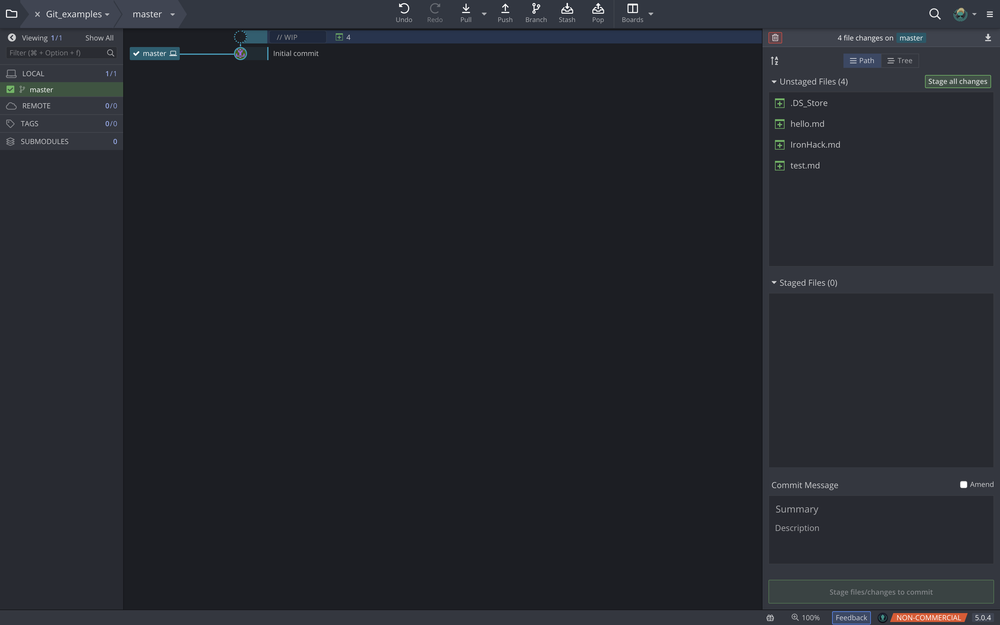
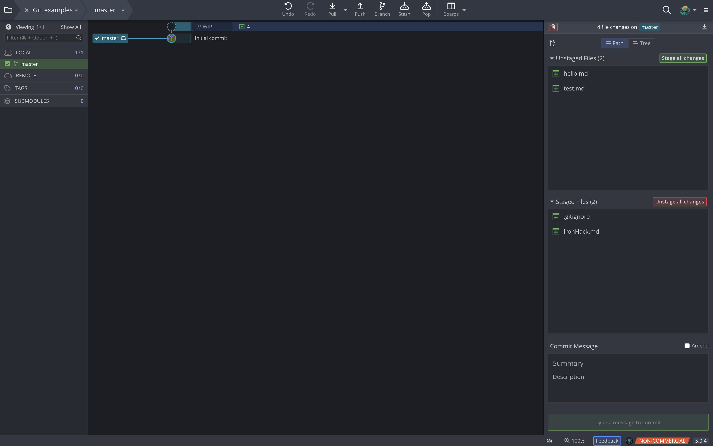
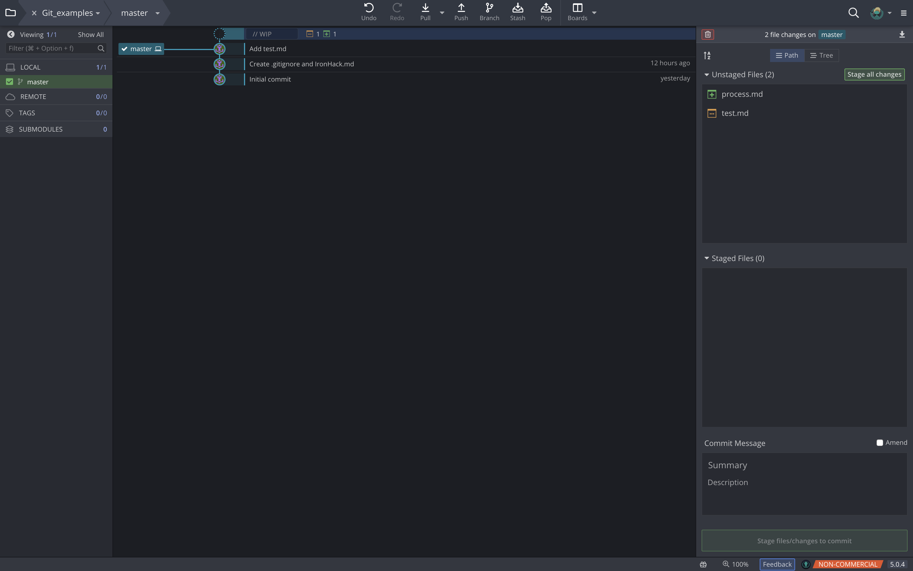
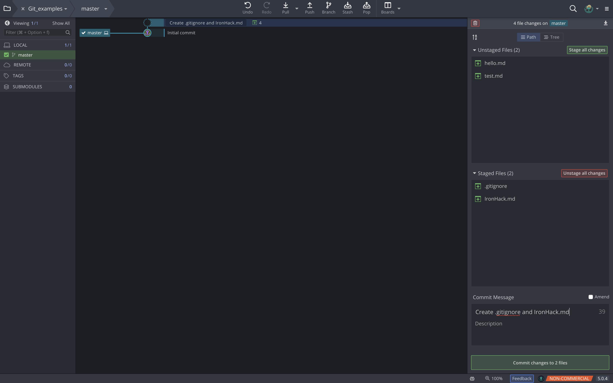
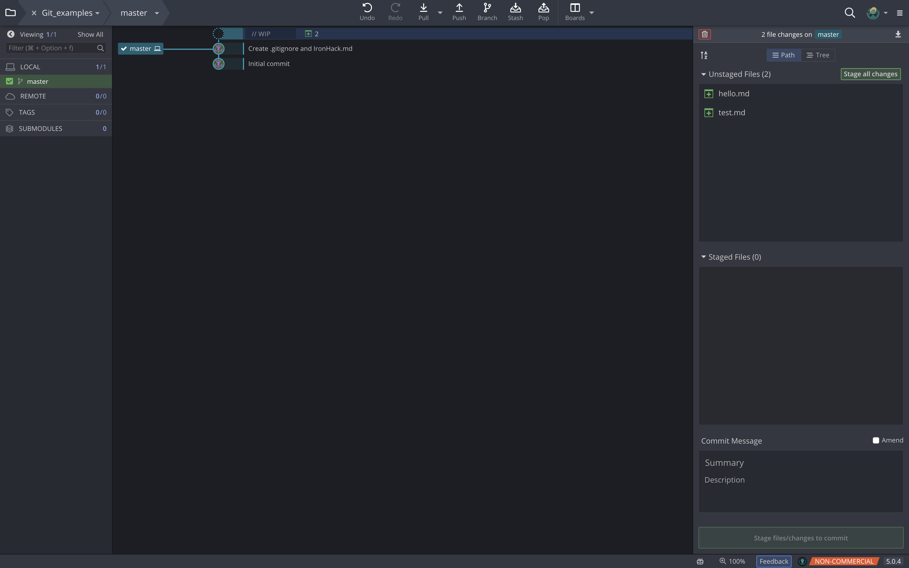

# Git

## Introduction
Git is a version control system. Version control is important in technology development because it keeps track of all the changes you and your collaborators have made to the files in your project. If some of the changes you and your collaborators have made are not compatible, Git allows the team to discover the conflicts and resolve them. If some changes are found problematic after they are made, one can also revert to the previous correct version of the code. By using Git, you and your collaborators can work in parallel without worrying about one's work will mess up others'.

## How it works
Every time you save the state of your project (with the command *git commit*) Git basically takes a picture of what all your files look like at that moment and stores a reference to that snapshot. To be efficient, if files have not changed, Git doesn’t store the file again, just a link to the previous identical file it has already stored. Git thinks about its data more like a series of snapshots of a miniature filesystem.

## Three core areas
There are three core areas to git. These are the Working Directory, the Staging Area (also known as Index), and the Local Repository. When working in a git repository files and modifications will travel from the Working Tree to the Staging Area and finish at the Local Repository. Thus we will talk about these three areas in that order.

### Working Tree or Working Directory
Is the directory you're storing your files in. This area is also known as the "untracked" area, since you're not telling git to be aware of these files yet.
Git Kraken will let you know when you have untracked files in the right column under "Unstaged files".

In the right column GitKraken let us know that we have 4 files that are not beign tracked yet

### Staging Area
This is a virtual folder where you will track the files in your working directory, this means that Git will take a snapshot of the file's current status and it will aknowledge that the file exists, we can do this using the button *Stage all changes*, in the top right corner, or clicking on a single file to pick what you will stage. Now when we modify the file, Git Kraken will let you know putting that file in the "Unstaged Files" and changing its icon to brown with 3 dots.

Having added .gitignore and IronHack.md to the Staging Area

    

Having modified the test.md file

### Local Repository
Is everything in the .git directory, mainly all of your commits. This is the area where everything's stored, like a local database.
To add items from the staging area to the local repository you simply write a commit message, bottom right corner, and then press the green button below this area (*Commit changes to n file*). A commit is simply a checkpoint, telling Git to track all changes that have occurred up to this point using our last commit as a comparison. After commiting, the staging area will be empty.

Writing a commit message

When you commit files, you will see (in the center of your Git Kraken screen) that a new element is added to your commit tree with the message you used.

### Basic Git Workflow

The basic Git workflow goes something like this:

- You modify files in your working tree.

- You selectively stage just those changes you want to be part of your next commit, which adds only those changes to the staging area.

- You do a commit, which takes the files as they are in the staging area and stores that snapshot permanently to your Git directory.

If a particular version of a file is in the Git directory (.git folder), it’s considered committed. If it has been modified and was added to the staging area, it is staged. And if it was changed since it was checked out but has not been staged, it is modified. 

    
    
    