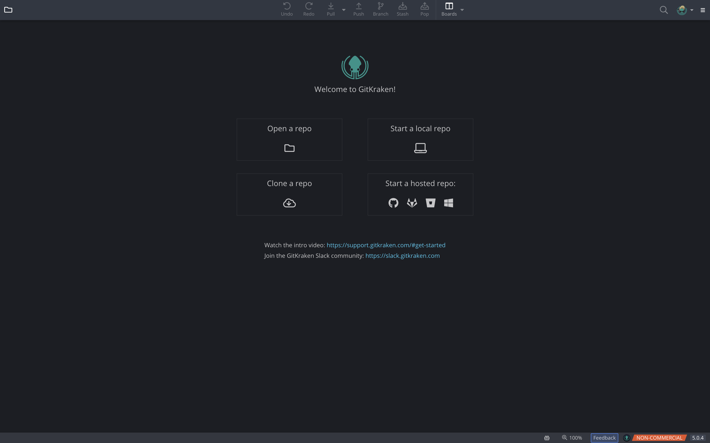
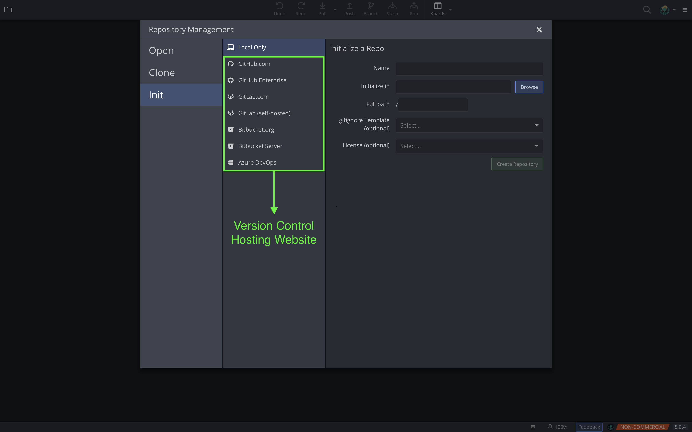
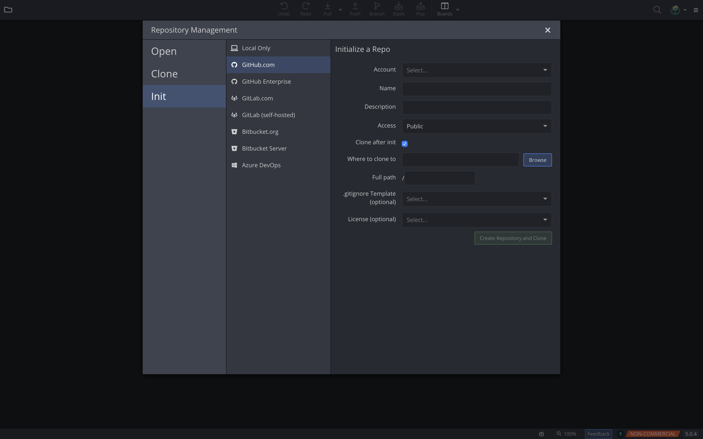
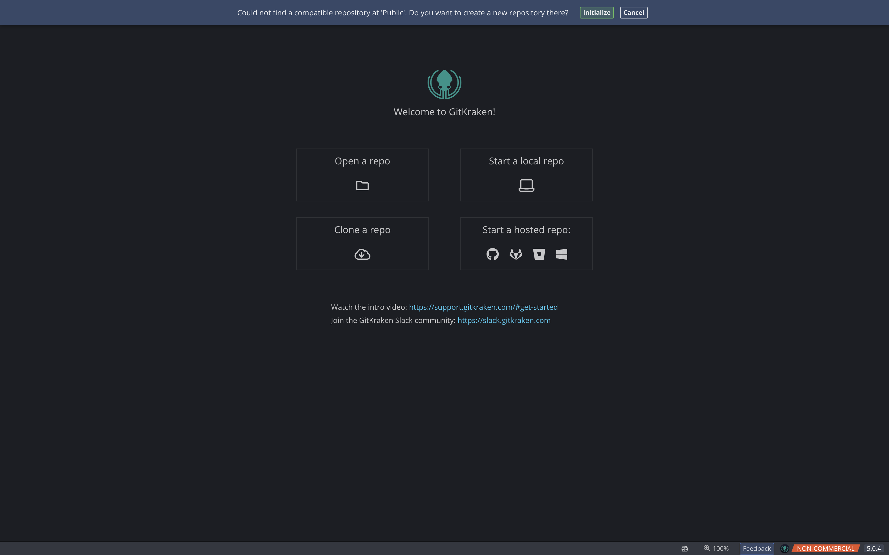
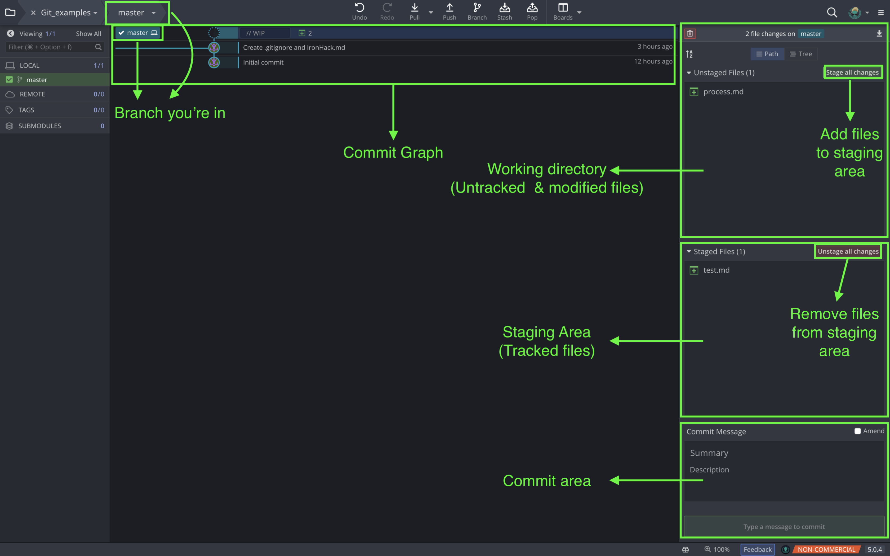
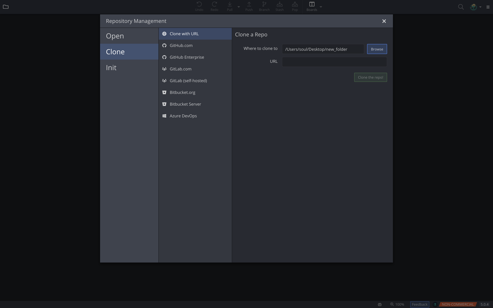
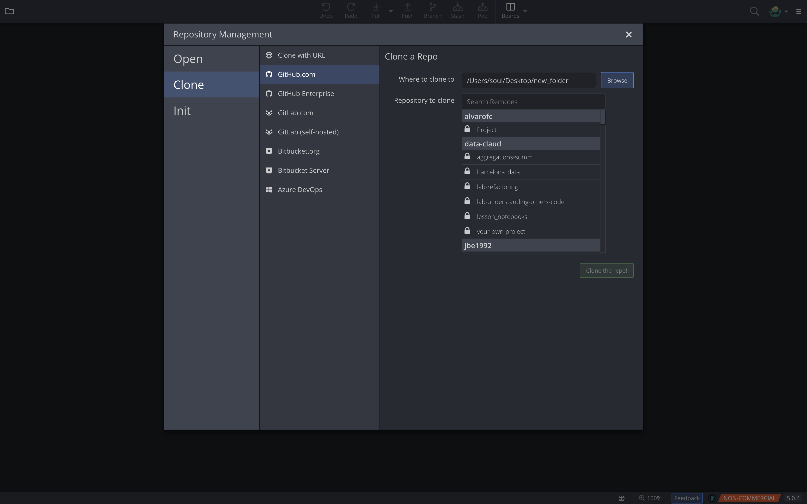

# GitKraken

GitKraken is a Git GUI (Graphical User Interface) for software developers using Windows, Mac and Linux. It simplifies complicated commands into drag and drop actions. It also makes working with remote repositories easier through integrations (linking together different software applications) with GitHub, Bitbucket and GitLab. You can even resolve merge conflicts without ever leaving the app. 

## First steps

When you open Git Kraken you will see this window:

These four buttons can be summarized in three actions:

#### Init
Can be done locally, which creates a .git directory in the specified folder; or remotely, which makes you select a version control hosting webpage and creates a repository in your account.

Init menu. In the marked column you can choose if you're going to initialize a local or remote repository

- Local: You're working in your own computer. You can always add a remote repository and upload your files there later on. 
Let's look at the different cells we have to fill:
    * Name: this will be your repository name, i.e., you local folder name where all your files will be stored.
    * Initialize in: the path were your repository will be located, i.e., the location in your computer where you want to create    your repository.
    * Full path: it will be filled automatically, but adding something at the end will create another folder and initialize your repository there.
    * .gitignore Template: .gitignore is a file that helps us avoid tracking files that we don't want in our version, i.e., is like a blacklist where you put things that Git will completely ignore.
    

- Remote: You're uploading your files to a version control hosting website. We will have a look at the GitHub.com option, since we're going to be using it:
    * Account: very self-explanatory. To work in these sites, you will need an account.
    * Name: name of your repository. When you download your repository, you will get a folder with the name you gave your repository.
    * Description: A short text that you want people to see when entering you repository. This is optional.
    * Access: Public or private.
    * Clone after init --> If you mark this box, you will get 4 additional cells to fill, that decide where to store the repository, the .gitignore template and the license (that are the same as when we initialize a local repository).

#### Open
Open a folder that contains a .git directory. If it doesn't find a .git directory in the path you provided, then a message will display asking you if you want to initialize a repository in that folder.

The message that you get when trying to open a folder that hasn't been initialized.

If you selected a path with an already initialized repo, it will show all the history of your commits and let you keep working with Git in the selected repository. In the following image, you will have the main areas highlighted:

#### Clone
Select the version control hosting webpage that you're going to use and download the repository in a folder of your choice.
If you have connected Git Kraken to the webpage you can select the repository directly. If not, you can select the first option (Clone with URL) and then use the URL where you have your remote repository to download it.

Cloning a repository using a URL

Cloning a repository using the GitHub.com option

