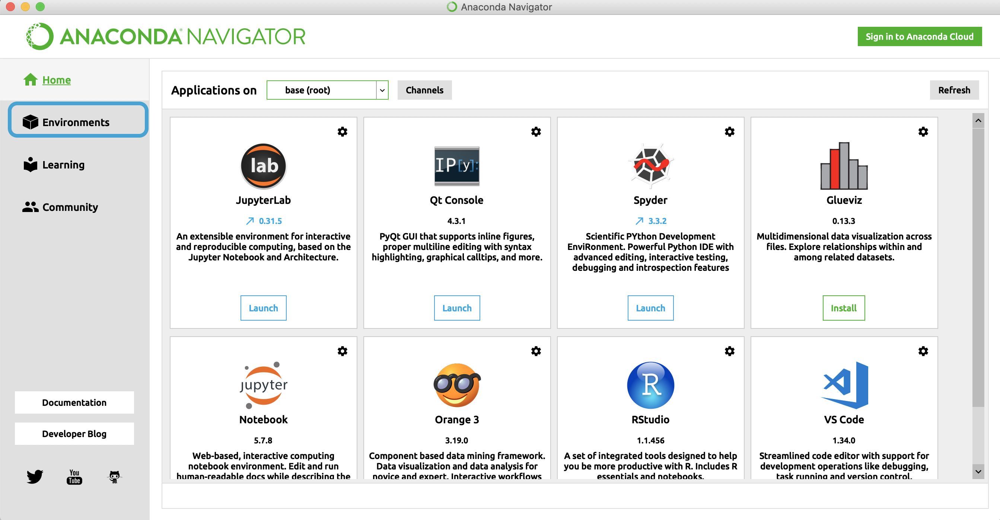
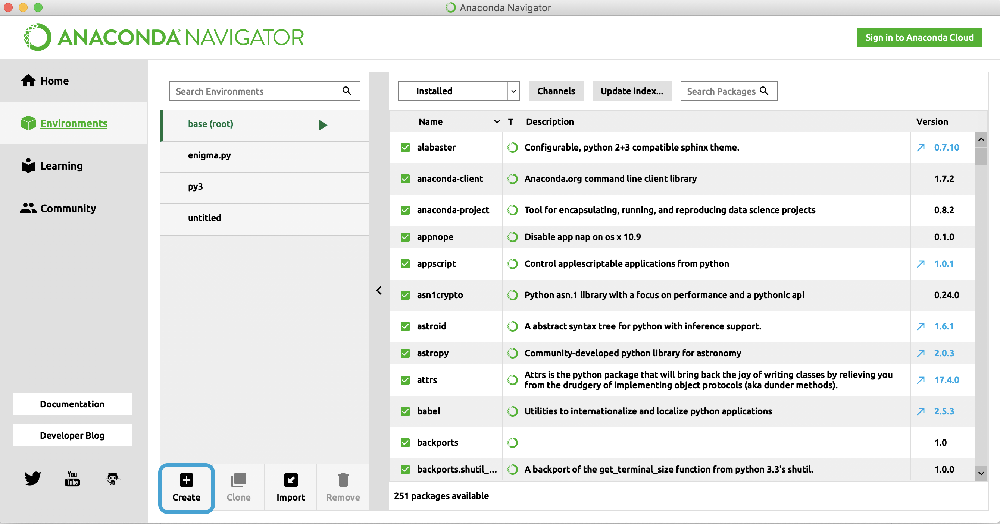
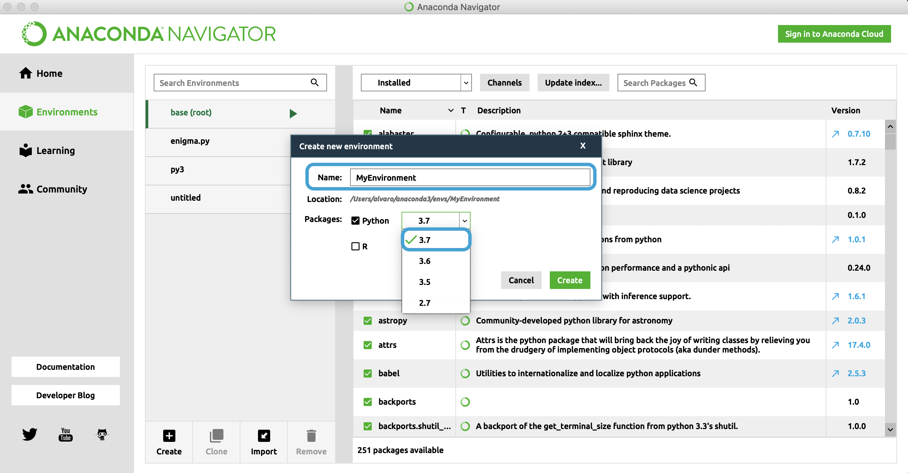

# Creating a virtual environment on your computer

A virtual environment is like a sandbox on your computer that lets you install software different than the one you have on the 
usual environment of your machine. It creates a folder which contains all the necessary executables to use the packages that a
Python project would need. For example, you could have Python 2.6 installed automatically in your computer but you want
Python 3.7 for your project and also want to add Jupyter Notebook and other libraries.

For the bootcamp, you will need a virtual environment in your computer!

## How to create a virtual enviromment with Anaconda
#### 1. Once you have Anaconda open, go to the environments tab on the left menu. 

#### 2. There, click on the create button at the bottom of the page. 

#### 3. On the new window, give a name to your virtual environment, make sure that you have python 3.7 selected and click create.

Once it has finished loading, you can go to your terminal and input `source activate MyEnvironment` (instead of MyEnvironment you should input the name you gave to your environment) to start it, now you can install all the software you might need!

To exit, type `deactivate`.

## How to create a virtual enviroment with terminal

Download virtualenv using:

`pip install virtualenv`

If you didn't have any problem, you can create the virtual environment inputing:

`virtualenv myenvironment`

You can choose the name of your virtual environment changing the `myenvironment`.

Now to activate it you must type this on your terminal: `source nameofmyenviroment/bin/activate`.

Now you can start installing the software you need in your new enviroment. To exit it, type `deactivate`.
