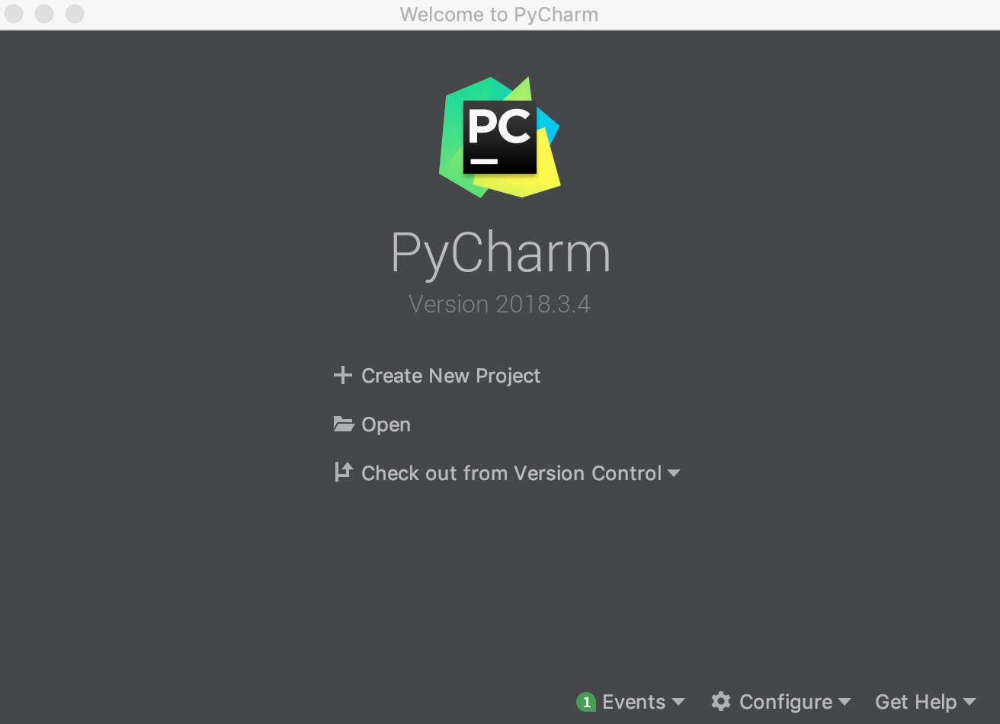
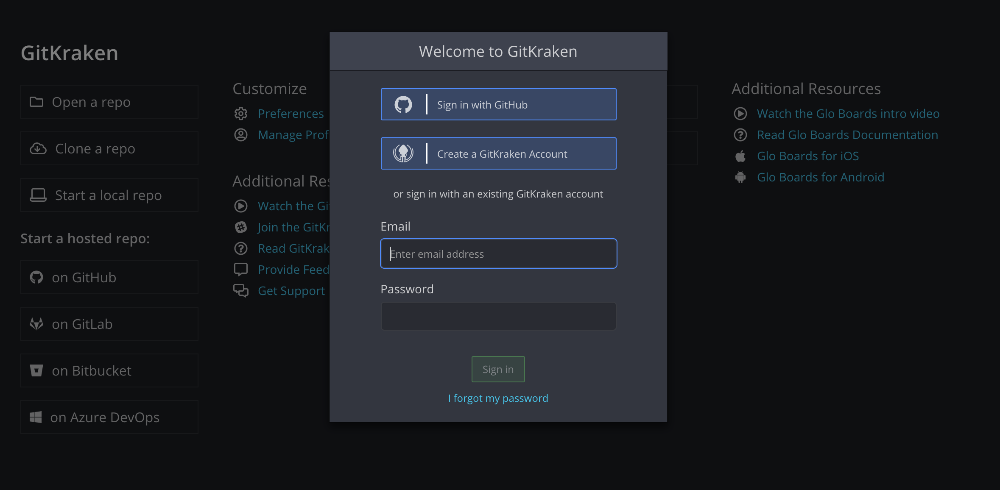

# Software Checklist

## Introduction
In order to start the data experience properly, you need to make sure that you have installed all the required software correctly in your computer. If you have doubts about any installation process, please contact your TAs **before the start of the course**. 

Later on the course, you will need to install other software and packages but for now, let's take a look at what you need to install before the start of the course. 

## Checklist
This is the complete list of required software and settings. 

- [ ] HomeBrew *
- [ ] Brew Cask * 
- [ ] Pip3
- [ ] Python 3
- [ ] MySQL
- [ ] Sequel Pro *
- [ ] MySQL Workbench **
- [ ] Localhost Connection
- [ ] Jupyter Notebook
- [ ] Virtual Environment
- [ ] PyCharm
- [ ] Git
- [ ] Git Kraken

You can use the checklist above to keep track of which software you have already installed. 

The * symbol indicates that the software is required only for MacOS users.   
The ** symbol indicates that the sofware is required only for Linux users.   

## Software Verification
Let's verify that you have already installed everything you need. Please follow the guides below.

### Homebrew
Remember that you only need Homebrew if you are a MacOS user. 

To verify that Homebrew is installed, open your terminal and type:
```console
brew --version
```
If the result is 'command not found', your installation was not successful or completed.     
If the output is the version of Homebrew you have installed, then everything is correct.   

### Brew Cask
Remember that you only need Brew Cask if you are a MacOS user. 

To verify that Brew Cask is installed, open your terminal and type:
```console
brew cask
```
If the result is 'command not found', your installation was not successful or completed.      
If the output is a brief summary of Brew Cask commands, then everything is correct.    

### Pip3
To verify that pip3 is installed, open your terminal and type:
```console
pip3
```
If the result is 'command not found', your installation was not successful or completed.      
If the output is a brief summary of pip3 commands, then everything is correct.  

### Python 3
To verify that Python 3 is installed, open your terminal and type:
```console
python3 --version
```
If the result is 'command not found', your installation was not successful or completed.        
If the output is the version of Python 3 you have installed, then everything is correct.   

### MySQL
To verify that MySQL is installed, open your terminal and type:
```console
mysql --version
```
If the result is 'command not found', your installation was not successful or completed.        
If the output is the version of MySQL you have installed, then everything is correct.   

### Sequel Pro
Remember that you only need Sequel Pro if you are a MacOS user. 

To verify that Sequel Pro is installed, launch a Finder window and navigate to the Applications folder. Look for Sequel Pro and launch it. 

If Sequel Pro starts and you can see the connection window, then everything's correct.   
If you can't find Sequel Pro on your Applications folder or you get an error when launching it, your installation was not successful or completed.   

Now, let's check if you can connect to your localhost as explained in "Install MySQL and Sequel Pro" lesson. Create a connection using your credentials and the following connection details:

* Connection Method: TCP/IP
* Name: Localhost
* Host: 127.0.0.1
* Username: root
* Password: your personal mysql password
* Port: 3306

If you can connect, then perfect! Everything is ready!  
If you can't, check the "Localhost Connection" section. 

### MySQL Workbench
Remember that you only need Sequel Pro if you are a Linux user. 

To verify that MySQL Workbench is installed, open the main menu of your Linux distribution, navigate to Applications, look for MySQL Workbench and try to launch it. You can also just use the search bar on the main menu to find it and launch it. 

If MySQL Workbench starts and you can see the connection window, then everything's correct.   
If you can't find MySQL Workbench on your Applications folder or you get an error when launching it, your installation was not successful or completed.

Now, let's check if you can connect to your localhost. Create a connection using your credentials and the following connection details:

* Connection Name: Localhost
* Connection Method: TCP/IP
* Hostname: 127.0.0.1
* Port: 3306
* Username: root
* Password: your personal mysql password

If you can connect, then perfect! Everything is ready!  
If you can't, check the "Localhost Connection" section. 

### Localhost Connection
If you try to connect to your localhost and you get the following error: "Authentication plugin 'caching_sha2_password' cannot be loaded", you might want to check this [link](https://stackoverflow.com/questions/49194719/authentication-plugin-caching-sha2-password-cannot-be-loaded). To solve the error, open the terminal and type:

```mysql
mysql -u root -p
```
Enter your password and you'll open the mysql command line. Now, you need to change the encryption of your password typing the line below. You need to replace <your-username> by root and <your-password> by your personal password.

```mysql
ALTER USER '<your-username>'@'localhost' IDENTIFIED WITH mysql_native_password BY '<your-password>';
```
Now you should be able to connect to your localhost using either Sequel Pro or MySQL Workbench and your credentials. 

If any other error occurs while trying to connect, contact your TAs for assistance. 

### Jupyter Notebook
To verify that Jupyter Notebook is installed, open your terminal and type:
```console
jupyter notebook
```
If the result is 'command not found', your installation was not successful or completed.   
If the result is that a notebook opened in your web browser, then everything is correct.

### Virtual Environment
To check that you have created a virtual environment correctly using Anaconda, try to activate and deactivate the environment using the commands below. You need to replace <name-of-your-environment> with the name you gave to the virtual environment.

**Activate**
```console
conda activate <name-of-your-environment>
```
**Deactivate**
```console
conda deactivate
```
If you get an error message, your installation was not successful or completed.    
If you successfully run both commands, then everything is correct.

### PyCharm
**Verification for MacOS users**   
To verify that PyCharm is installed, launch a Finder window and navigate to the Applications folder. Look for PyCharm and launch it. 

If PyCharm starts and you can see the window in the image below, then everything's correct. 

<p align="center"></p>

If you can't find PyCharm on your Applications folder or you get an error when launching it, your installation was not successful or completed.

**Verification for Linux users**  
To launch PyCharm, open the main menu of your Linux distribution, navigate to Applications, look for PyCharm and try to launch it. You can also just use the search bar on the main menu to find it and launch it. 

If PyCharm starts and you can see the window in the image above, then everything's correct.   
If you get an error when launching it, your installation was not successful or completed.  

If you can't find PyCharm in your applications folder, you might have skipped the part of the installation where you create a PyCharm desktop entry. In that case, please review your installation process. Check this [PyCharm Installation Video](https://www.youtube.com/watch?v=cVROiVgR_qg) to double check that you followed every step. 

If after double checking, you still can't find PyCharm or you get an error when launching it, your installation was not successful or completed.

### Git
```console
git --version
```
If the result is 'command not found', you need to install git.     
If the output is the version of git you have installed, then everything is correct. 

### Git Kraken
To verify that Git Kraken is installed if you are a **MacOs user**, launch a Finder window and navigate to the Applications folder. Look for Git Kraken and launch it. 
   
To launch Git Kraken if you are a **Linux user**, open the main menu of your Linux distribution, navigate to Applications, look for Git Kraken and try to launch it. You can also just use the search bar on the main menu to find it and launch it. 

If after launching Git Kraken, it starts and you can see the window below, then everything's correct.    

<p align="center"></p>

If you can't find Git Kraken or you get an error when launching it, your installation was not successful or completed. 

## Summary
If you got this far, then congratulations! Your computer is more than ready to face the Data Analytics challenge at Ironhack! 
